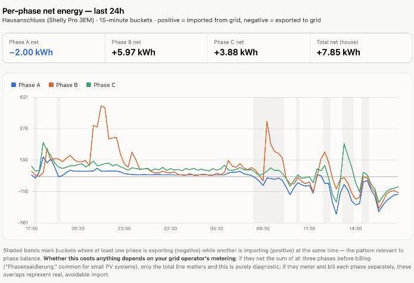

# shelly-em-mcp

[](https://github.com/mregen/shelly-em-mcp/actions/workflows/build.yml)
[](https://www.nuget.org/packages/ShellyEmMcp)

A .NET-based Model Context Protocol (MCP) server for [Shelly](https://www.shelly.com/) smart-home power meters, installable as a .NET tool from [nuget.org](https://www.nuget.org/packages/ShellyEmMcp) — query your home's live power draw and energy totals straight from an LLM.

**This is an independent, community-built project - not an official Shelly product.** It talks directly to your own Shelly devices over your local network using their published local RPC API. "Shelly" is a trademark of its respective owner, used here only to describe device compatibility.

## Purpose

A Shelly energy meter (Pro 3EM, EM, Plus PM, etc.) tracks live power draw and cumulative energy down to the phase, but that data normally only surfaces in the Shelly app. This project connects it to an LLM directly, so you can ask about your home's power usage in plain language.

An example of what that looks like once the tools are connected (illustrative - your own numbers will differ):

> **You:** What's my current power draw?
>
> **Claude:** Your Hausanschluss meter is currently drawing 1.4 kW total - 620 W on phase A, 480 W on phase B, and 310 W on phase C.

`get_energy_history`'s bucketed output is enough for an LLM client to reason about patterns
over time, not just single readings - a real example from this project's own development:

> **You:** This household has a PV which can feed up to 5kW into the house system. However,
> it's an East/West config (6kW divided to a 3/3 east/west), so the max full power that can be
> achieved is roughly 4.5kW. Please analyze the 24 hours of power usage and feedback, so I can
> determine an imbalance in how the electric consumption is divided.
>
> **Claude:** In 18 of the last 96 fifteen-minute buckets, Phase A was exporting to the grid
> while Phase B and/or C were simultaneously importing - about 0.62 kWh/day of self-consumption
> that a 3-phase-balanced PV inverter couldn't reach because the load wasn't on that phase.
> Phase B runs consistently heaviest, with a sharp spike around 21:00-22:00 suggesting a
> scheduled appliance. Whether this is worth fixing depends on whether your grid operator meters
> phases separately or nets their sum before billing.



The chart itself isn't something this MCP server renders - it's what the LLM client built from
`get_energy_history`'s per-bucket JSON. Shown here as an example of what's possible with the raw
data this tool returns, not a claim that charting is a built-in feature.

## Requirements

- **.NET 8 or .NET 10 runtime** - to install and run the tool (see [Install](#install) below)
- **An MCP-capable LLM client** - Claude Code, Claude Desktop, or LM Studio (see [Configure Claude Code, Claude Desktop, or LM Studio](#configure-claude-code-claude-desktop-or-lm-studio) below)
- **A Shelly Gen2/Gen3 EM-class device on your local network** (Pro 3EM, 3EM, EM, Plus PM, Plus 1PM) - reachable at a fixed LAN IP

## Status

Working, verified against a real Shelly Pro 3EM (`SPEM-003CEBEU`, firmware 2.0.0, `triphase`
profile) on the local network.

| Feature | Status |
|---|---|
| Local device status (uptime, cloud connectivity) | ✅ Working, verified live |
| Live per-phase power/voltage/current/power-factor/frequency/error flags | ✅ Working, verified live |
| Cumulative energy totals (consumed/returned, per phase) | ✅ Working, verified live |
| Alarm/CT-type configuration | ✅ Working, verified live |
| Local energy history (on-device, no Cloud), net Wh per phase bucketed by time | ✅ Working, verified live - see `CLAUDE.md` for why it reports *net* energy rather than separate consumed/returned |
| Live browser dashboard (`--dashboard`) | ✅ Working, verified live - see [Live dashboard](#live-dashboard) below |
| Switch/relay control | ⏳ Not built - none of the devices tested against have a relay |
| Gen1 device support (older 3EM/EM REST API) | ⏳ Not built - not needed for a Gen2/Gen3 device |
| `monophase` profile (per-channel EM1/EM1Data instead of combined EM) | ⏳ Not built - assumes the default `triphase` profile |
| Shelly Cloud API support | ⏳ Design sketch only - see [`docs/cloud-api.md`](docs/cloud-api.md) |

See [open issues](https://github.com/mregen/shelly-em-mcp/issues) for the current roadmap.

## Security

The HTTP transport has **no authentication or authorization layer yet** - anyone who can reach
the endpoint can call any tool, including the ones reading your home's live power data. This is
fine for local use (stdio, or `--http` left on `localhost`), but it means **this must not be
exposed publicly** - no public Docker hosting, no binding to `0.0.0.0` on an open network.

Separately, the server itself talks to your Shelly devices in plaintext over your LAN (Shelly's
Gen2 local RPC API has no TLS) - normal for local smart-home devices, but worth knowing if your
network isn't trusted.

## Available tools

| Tool | Notes |
|---|---|
| `list_devices` | All configured devices with reachability, model, generation, firmware, app, and local-auth status |
| `get_status` | System status (uptime, cloud connectivity) for one device or all |
| `get_power` | Current total active power (W) for one device, or all devices plus a combined total |
| `get_energy_live` | Full per-phase breakdown (voltage, current, active/apparent power, power factor, frequency, error/alarm flags for A/B/C, plus neutral current and totals) for one device |
| `get_energy_totals` | Cumulative energy counters (Wh consumed/returned, per phase and total) for one device |
| `get_energy_config` | CT type, phase-reversal settings, and alarm thresholds (under/over voltage, current, power per phase) for one device |
| `get_energy_history` | Net energy per phase (consumed minus returned) over a recent time window, bucketed from the device's own on-device history (no Shelly Cloud needed); max window 7 days |

## Install

Requires the .NET 8 or .NET 10 SDK - the package multi-targets both, so `dotnet tool install`
picks whichever one matches your installed SDK automatically.

```bash
dotnet tool install --global ShellyEmMcp
```

This installs a `shelly-em-mcp` command. Confirm it's on your PATH with `shelly-em-mcp --version`
(the .NET tools directory, `~/.dotnet/tools`, needs to be there - the installer usually adds it
automatically).

## Configure your devices

Devices are plain configuration - a name and a LAN IP/hostname, no account or API key needed for
local access. Add them to `appsettings.json` next to the installed tool, or override via
environment variables using .NET's array-binding convention:

```bash
export Shelly__Devices__0__Name="Hausanschluss"
export Shelly__Devices__0__Host="192.168.1.100"
```

Add more devices by incrementing the index (`Shelly__Devices__1__Name`, etc.).

## Run it

The server supports two transports, chosen at startup - **stdio by default**, or HTTP via a flag:

```bash
shelly-em-mcp                                       # stdio - for MCP clients that spawn the process directly
shelly-em-mcp --http --urls http://localhost:5250    # HTTP - a long-running server on a port
```

In HTTP mode the MCP endpoint is at `<url>/mcp` (Streamable HTTP), e.g. `http://localhost:5250/mcp`.

## Live dashboard

No LLM client needed for this one - `--dashboard` runs `shelly-em-mcp` as its own small web app
instead of an MCP server, so you can leave a browser tab open and glance at your home's live power
draw, assuming the Shelly EM IP address is 192.168.1.100:

```bash
shelly-em-mcp --dashboard --urls http://localhost:5260 --Shelly:Devices:0:Name=Hausanschluss  --Shelly:Devices:0:Host=192.168.1.100
```

Then open `http://localhost:5260` in a browser. It shows:

- A live power widget - current net power in kW, green when you're exporting to the grid (PV
  surplus available) and red when you're importing - refreshed every few seconds. This is the
  "can I start the dishwasher right now" check: green means yes, there's spare PV to use.
- A chart of today's per-phase net energy so far (the same bucketed data `get_energy_history`
  returns), refreshed about once a minute.

It's plain polling from the browser to two small JSON endpoints (`/api/power`,
`/api/history/today`) - no build step, no WebSocket, nothing to install beyond the tool itself.
The same [Security](#security) note applies: don't expose this beyond `localhost`/your own LAN.

## Configure Claude Code, Claude Desktop, or LM Studio

**Can these clients start `shelly-em-mcp` automatically?** Yes - all three spawn a local stdio
process directly from their own config, no server to keep running yourself.

### Find the installed binary's absolute path

GUI-launched apps often don't inherit the PATH your terminal has, so the bare `shelly-em-mcp`
command name may not resolve even though it works in a shell. Use the absolute path instead:

- macOS/Linux: `~/.dotnet/tools/shelly-em-mcp`
- Windows: `%USERPROFILE%\.dotnet\tools\shelly-em-mcp.exe`

### Claude Code

```bash
claude mcp add shelly-em-mcp -- ~/.dotnet/tools/shelly-em-mcp
```

Restart or reconnect your Claude Code session - new MCP registrations aren't picked up
mid-session.

### Claude Desktop

Edit `claude_desktop_config.json` (macOS:
`~/Library/Application Support/Claude/claude_desktop_config.json`; Windows:
`%APPDATA%\Claude\claude_desktop_config.json`):

```json
{
  "mcpServers": {
    "shelly-em-mcp": {
      "command": "/Users/you/.dotnet/tools/shelly-em-mcp",
      "args": [],
      "env": {
        "Shelly__Devices__0__Name": "Hausanschluss",
        "Shelly__Devices__0__Host": "192.168.1.100"
      }
    }
  }
}
```

Restart Claude Desktop to pick it up.

### LM Studio

LM Studio's MCP config (`mcp.json`) follows the same `command`/`args`/`env` shape as Claude
Desktop above. Its documented path is `~/.lmstudio/mcp.json` (macOS/Linux) /
`%USERPROFILE%\.lmstudio\mcp.json` (Windows), but there are user reports of the real path
differing by version/OS - rather than guessing, use the in-app editor: **Program tab → Install
→ Edit `mcp.json`**, which opens whichever file is actually authoritative for your install, and
paste in the same JSON shown for Claude Desktop above (just the inner object works too, since
LM Studio also uses an `mcpServers` map).

## Building from source / contributing

Not needed just to use the tool - see [`docs/DEVELOPER.md`](docs/DEVELOPER.md) in the repo for
running from a clone, architecture notes, and how NuGet publishing works.

## License

MIT — see [LICENSE](LICENSE).
